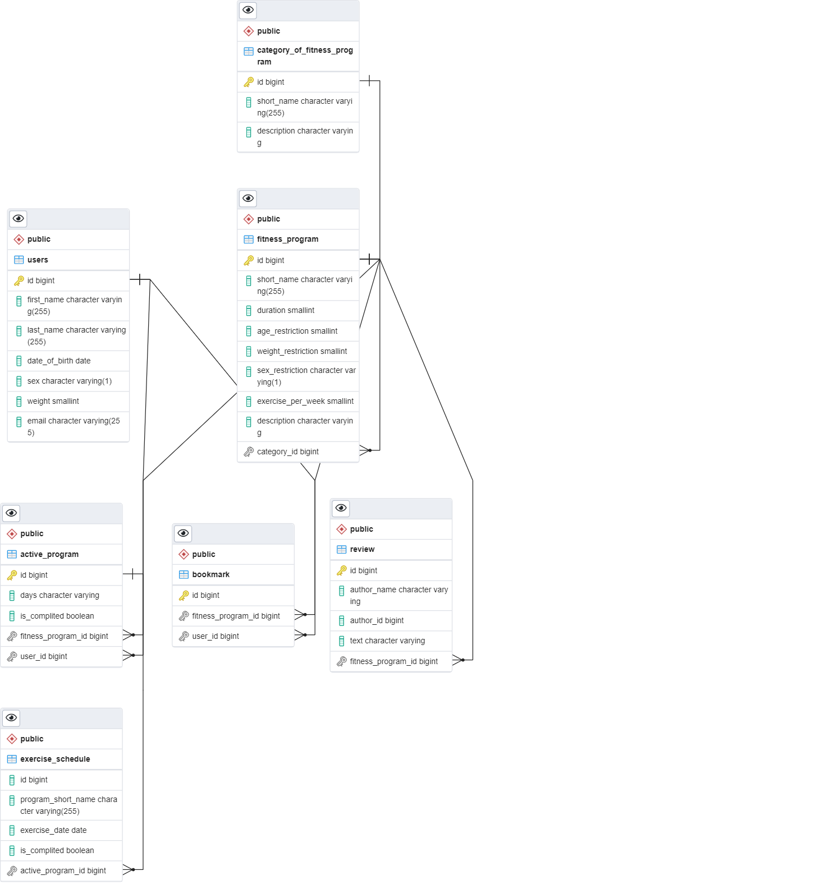

# Selection and tracking of fitness programs

### Description

Selection of fitness programs according to the parameters of the person and the duration of the course,
scheduling and reminder of classes. It is also possible to view information about the programs and add reviews.

### DB scheme
The structure of model links in our fitness app is shown below

### Getting Started
    First, run:
    './mvnw clean install'
    Next:
    'docker-compose -f docker-compose.yml up -d --build'

and open link http://localhost:8122/fitnessweb-app

You can also use the Swagger UI at link http://localhost:8124/fitnessDB-app/swagger-ui

